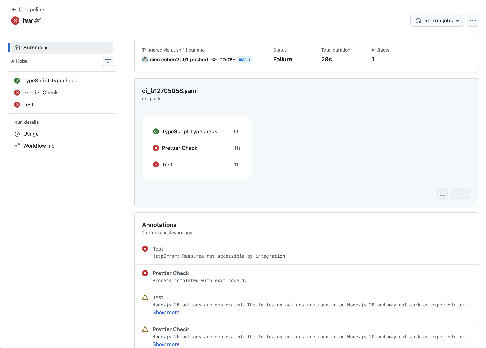

# B12705058 陳冠宇 — CI/CD 作業報告

## 一、CI Pipeline 說明

### 1.1 Workflow 檔案內容

檔案路徑：`.github/workflows/ci_b12705058.yaml`

```yaml
name: CI Pipeline

on:
  push:
    branches: ['*']
  pull_request:
    branches: ['*']

permissions:
  contents: read
  checks: write

jobs:
  typecheck:
    name: TypeScript Typecheck
    runs-on: ubuntu-latest
    steps:
      - uses: actions/checkout@v4
      - uses: actions/setup-node@v4
        with:
          node-version: 22
          cache: npm
      - run: npm ci
      - run: npm run typecheck

  prettier:
    name: Prettier Check
    runs-on: ubuntu-latest
    steps:
      - uses: actions/checkout@v4
      - uses: actions/setup-node@v4
        with:
          node-version: 22
          cache: npm
      - run: npm ci
      - run: npm run format:check

  test:
    name: Test
    runs-on: ubuntu-latest
    steps:
      - uses: actions/checkout@v4
      - uses: actions/setup-node@v4
        with:
          node-version: 22
          cache: npm
      - run: npm ci
      - run: npm run test -- --reporter=junit --outputFile=test-results.xml
      - name: Upload test results
        if: always()
        uses: actions/upload-artifact@v4
        with:
          name: test-results
          path: test-results.xml
      - name: Publish test results
        if: always()
        uses: dorny/test-reporter@v1
        with:
          name: Vitest Results
          path: test-results.xml
          reporter: java-junit
```

### 1.2 Pipeline 設計說明

本 CI pipeline 在每次 push 或 pull request 時自動觸發，包含三個**平行執行**的 job：

| Job | 執行指令 | 用途 |
|---|---|---|
| **TypeScript Typecheck** | `npm run typecheck` (`tsc --noEmit`) | 檢查 TypeScript 型別是否正確 |
| **Prettier Check** | `npm run format:check` (`prettier --check .`) | 檢查程式碼格式是否符合 Prettier 規範 |
| **Test** | `npm run test` (`vitest run`) | 執行 Vitest 單元測試 |

**使用的 GitHub Actions：**

- `actions/checkout@v4` — 取得程式碼
- `actions/setup-node@v4` — 設定 Node.js 22 環境，並啟用 npm cache
- `actions/upload-artifact@v4` — 上傳測試結果 XML 作為 artifact
- `dorny/test-reporter@v1` — 將 JUnit XML 測試結果顯示在 GitHub Actions 結果頁面

**設計重點：**

- 三個 job 平行執行，加快 pipeline 速度
- 任一 job 失敗即顯示 pipeline 失敗
- 測試結果透過 `dorny/test-reporter` 以 JUnit 格式發佈到 GitHub Actions 頁面，方便直接在網頁上查看每個測試案例的通過/失敗狀態
- 設定 `permissions: checks: write` 讓 test-reporter 有權限建立 check run

---

## 二、CI 執行結果截圖

### 2.1 成功執行

（請在修正後的 pipeline 成功執行後，截圖貼於此處）

<!-- 截圖：GitHub Actions 頁面顯示三個 job 全部綠勾 -->

---

## 三、失敗案例說明

### 3.1 失敗截圖



### 3.2 錯誤分析

此次 pipeline 失敗包含兩個錯誤：

**錯誤一：Prettier Check 失敗**

- **現象：** Prettier Check job 以 exit code 1 結束
- **原因：** `.prettierignore` 未排除非核心檔案（如 `docker-compose.yml`、`snippets/` 目錄、`.claude/` 設定檔等），導致這些檔案的格式不符合 Prettier 規範而報錯
- **修正方式：** 更新 `.prettierignore`，加入這些不需要格式檢查的檔案與目錄

**錯誤二：Test job 失敗 — `HttpError: Resource not accessible by integration`**

- **現象：** 測試本身通過，但 `dorny/test-reporter` 在發佈測試結果時報錯
- **原因：** Workflow 未設定 `permissions`，GitHub Actions 預設權限不足，`test-reporter` 無法建立 check run
- **修正方式：** 在 workflow 中加入 `permissions: checks: write` 授予寫入 check 的權限

### 3.3 修正內容

1. 在 `ci_b12705058.yaml` 頂層加入：
   ```yaml
   permissions:
     contents: read
     checks: write
   ```

2. 更新 `.prettierignore`，排除非核心檔案：
   ```
   dist/
   node_modules/
   .claude/
   snippets/
   docker-compose.yml
   *.md
   ```
